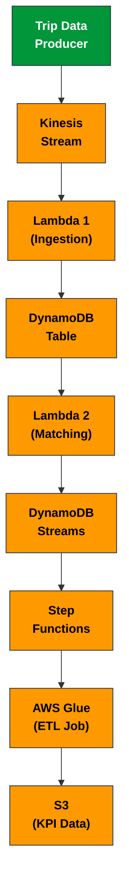
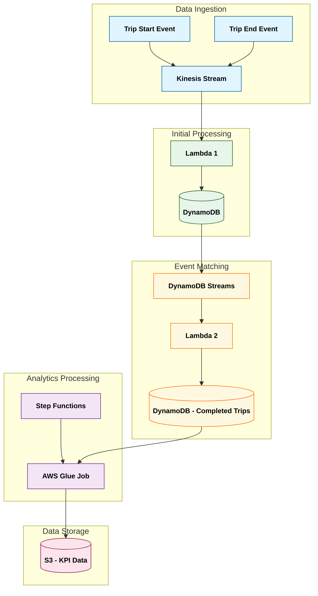
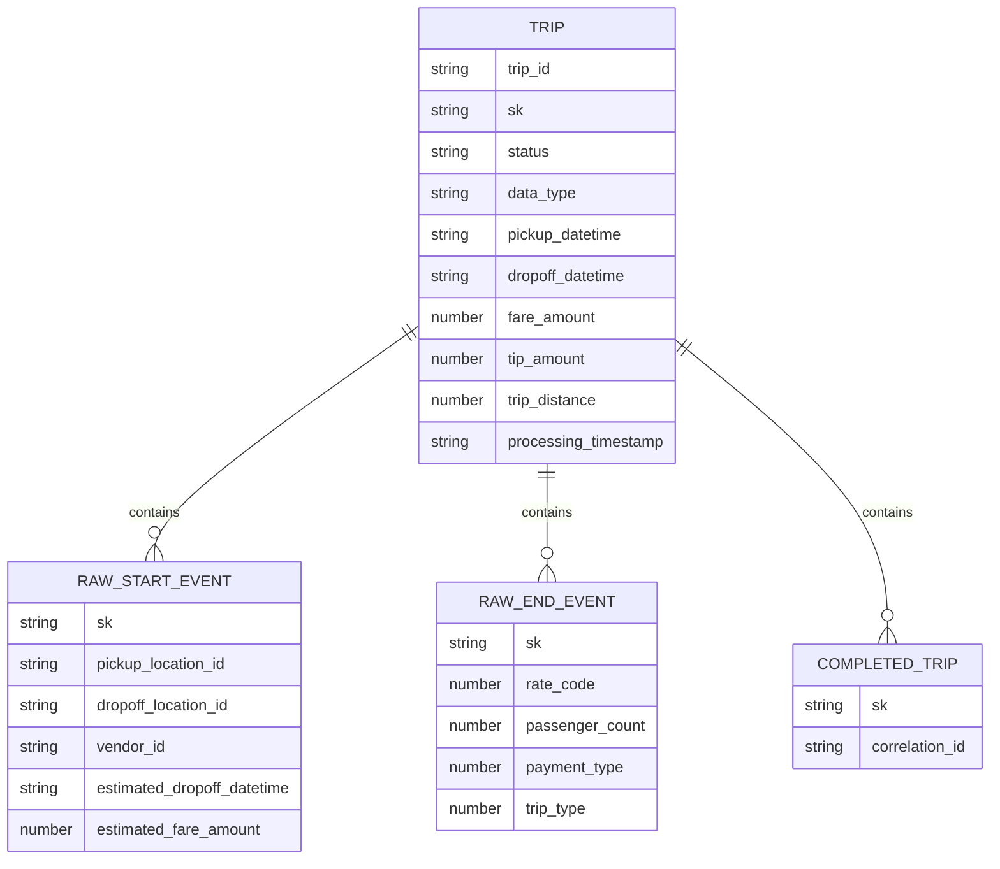
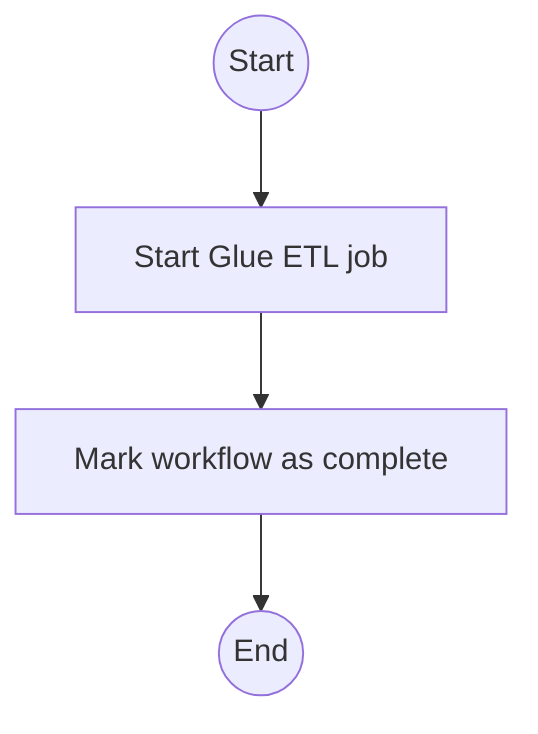

# NSP Bolt Ride - Real-Time Trip Processing System

## Project Overview

The NSP Bolt Ride Real-Time Trip Processing System is a scalable, event-driven architecture designed to ingest, process, and analyze trip data from a ride-hailing service in near real-time. The system captures trip start and end events through streaming infrastructure, stores and updates trip data in a NoSQL database, and generates daily analytics for business intelligence.

This project demonstrates a production-ready data pipeline using AWS-native services to handle high-volume event processing, stateful data management, and automated analytics generation.

## System Architecture

The system follows a serverless, event-driven architecture with the following components:



### Data Flow



The data flow consists of the following steps:

1. **Data Ingestion**: Trip start and end events are sent to an Amazon Kinesis stream
2. **Initial Processing**: Lambda function 1 processes Kinesis records and stores them in DynamoDB
3. **Event Matching**: Lambda function 2 listens to DynamoDB streams, matches trip start and end events, and creates completed trip records
4. **Analytics Processing**: AWS Step Functions triggers a Glue job on a schedule to process completed trips
5. **Data Storage**: Aggregated KPIs are stored in S3 in a structured, time-based hierarchy

## Component Details

### Amazon Kinesis

- **Purpose**: Ingests streaming trip data events (trip start and trip end)
- **Configuration**: Single stream named "Trips" with appropriate shards based on volume
- **Data Format**: JSON records containing trip details with data_type field indicating "trip_start" or "trip_end"

### AWS Lambda Functions

#### Lambda 1 (Ingestion)

- **Purpose**: Processes Kinesis stream records and writes to DynamoDB
- **Trigger**: Kinesis stream
- **Key Logic**:
  - Decodes base64 Kinesis data
  - Formats records for DynamoDB with appropriate data types
  - Uses batch writes for efficiency
  - Adds RAW# prefix to sort key for state tracking

#### Lambda 2 (Matching)

- **Purpose**: Matches trip start and end events to create completed trip records
- **Trigger**: DynamoDB Streams
- **Key Logic**:
  - Processes INSERT events from DynamoDB stream
  - Finds counterpart events (start/end) for each new event
  - Creates completed trip records when both start and end events exist
  - Updates processed events with a "processed" status

### Amazon DynamoDB

- **Table Name**: "trips"
- **Primary Key**: Composite key with trip_id as Partition Key and a prefixed timestamp as Sort Key
- **Data Model**:
  - PK: trip_id (String)
  - SK: Prefixed string with format:
    - RAW#trip_start#{timestamp} - For raw trip start events
    - RAW#trip_end#{timestamp} - For raw trip end events
    - COMPLETED#{timestamp} - For completed trip records
  - Additional attributes for trip details (fare, locations, timestamps, etc.)
- **Streams**: Enabled to trigger Lambda 2 for event matching



### AWS Glue

- **Job Name**: "TripsKPIs"
- **Purpose**: Processes completed trip records to generate daily KPIs
- **Trigger**: AWS Step Functions on schedule
- **Key Logic**:
  - Scans DynamoDB for completed trip records
  - Calculates daily KPIs:
    - total_fare: Sum of all fares for completed trips
    - count_trips: Total number of completed trips
    - average_fare: Average fare per trip
    - max_fare: Highest fare recorded
    - min_fare: Lowest fare recorded
  - Formats results as structured JSON with metadata
  - Writes to S3 with organized path structure

### Amazon S3

- **Bucket Name**: "trips-kpis-buckets-125"
- **Structure**:
  - daily_kpis/{year}/{month}/{day}/{timestamp}-daily_trip_kpis.json
  - daily_kpis/latest/daily_trip_kpis.json (always contains most recent data)
- **Data Format**: JSON with metadata and daily KPI records

### AWS Step Functions

- **Purpose**: Orchestrates the ETL workflow
- **States**:
  1. Glue StartJobRun: Triggers the Glue job
  2. Complete: Marks the workflow as complete



## Setup and Deployment

### Prerequisites

- AWS Account with appropriate permissions
- AWS CLI configured with access credentials
- Python 3.13+ for local development
- Required Python packages: boto3, pandas

### AWS Resources Setup

1. **Create Kinesis Stream**:

   ```bash
   aws kinesis create-stream --stream-name Trips --shard-count 1
   ```

2. **Create DynamoDB Table**:

   ```bash
   aws dynamodb create-table \
     --table-name trips \
     --attribute-definitions \
       AttributeName=PK,AttributeType=S \
       AttributeName=SK,AttributeType=S \
     --key-schema \
       AttributeName=PK,KeyType=HASH \
       AttributeName=SK,KeyType=RANGE \
     --provisioned-throughput ReadCapacityUnits=5,WriteCapacityUnits=5 \
     --stream-specification StreamEnabled=true,StreamViewType=NEW_IMAGE
   ```

3. **Create S3 Bucket**:

   ```bash
   aws s3 mb s3://trips-kpis-buckets-125
   ```

4. **Deploy Lambda Functions**:
   - Package and deploy lambda1.py with environment variable DYNAMODB_TABLE_NAME=trips
   - Package and deploy lambda2.py with environment variable DYNAMODB_TABLE_NAME=trips

5. **Create Glue Job**:
   - Upload glue_scripts.py to S3
   - Create Glue job named "TripsKPIs" using this script

6. **Create Step Functions State Machine**:
   - Use the step_functions.json definition to create the state machine

### Configuration

Key configuration parameters are set in the respective scripts:

- **Kinesis Stream Name**: "Trips" (in to_kinesis.py)
- **DynamoDB Table Name**: "trips" (in lambda1.py, lambda2.py, glue_scripts.py)
- **S3 Bucket Name**: "trips-kpis-buckets-125" (in glue_scripts.py)

## Usage

### Data Ingestion

To send trip data to the Kinesis stream:

```bash
python scripts/to_kinesis.py
```

This script reads trip start and end data from CSV files in the data directory and sends them to the Kinesis stream in chronological order.

### Monitoring

1. **Check DynamoDB Table**:

   ```bash
   aws dynamodb scan --table-name trips --limit 10
   ```

2. **View Latest KPIs**:

   ```bash
   aws s3 cp s3://trips-kpis-buckets-125/daily_kpis/latest/daily_trip_kpis.json -
   ```

### Manual ETL Execution

To manually trigger the ETL process:

```bash
aws stepfunctions start-execution --state-machine-arn <STATE_MACHINE_ARN>
```

## Troubleshooting

### Common Issues

1. **Missing Events in DynamoDB**:
   - Check Kinesis stream metrics for throttling
   - Verify Lambda 1 CloudWatch logs for errors
   - Ensure proper IAM permissions for Lambda to write to DynamoDB

2. **Incomplete Trip Matching**:
   - Verify both trip start and end events exist in DynamoDB
   - Check Lambda 2 CloudWatch logs for matching errors
   - Ensure DynamoDB Streams is properly configured

3. **Missing KPI Data**:
   - Check Glue job execution logs
   - Verify Glue job has permissions to read from DynamoDB and write to S3
   - Check Step Functions execution history

### Logging

All components write logs to CloudWatch Logs:

- Lambda functions: /aws/lambda/function-name
- Glue jobs: /aws/glue/jobs
- Step Functions: AWS Step Functions console

## Data Model

### Trip Start Event

```json
{
  "trip_id": "c66ce556bc",
  "pickup_location_id": 93,
  "dropoff_location_id": 93,
  "vendor_id": 1,
  "pickup_datetime": "2024-05-25 13:19:00",
  "estimated_dropoff_datetime": "2024-05-25 14:03:00",
  "estimated_fare_amount": 34.18,
  "data_type": "trip_start"
}
```

### Trip End Event

```json
{
  "trip_id": "c66ce556bc",
  "dropoff_datetime": "2024-05-25 14:05:00",
  "rate_code": 5.0,
  "passenger_count": 0.0,
  "trip_distance": 0.1,
  "fare_amount": 40.09,
  "tip_amount": 0.0,
  "payment_type": 3.0,
  "trip_type": 2.0,
  "data_type": "trip_end"
}
```

### Completed Trip Record (DynamoDB)

```json
{
  "PK": "c66ce556bc",
  "SK": "COMPLETED#2024-05-25 14:05:00",
  "trip_id": "c66ce556bc",
  "status": "completed",
  "pickup_location_id": 93,
  "dropoff_location_id": 93,
  "vendor_id": 1,
  "pickup_datetime": "2024-05-25 13:19:00",
  "dropoff_datetime": "2024-05-25 14:05:00",
  "fare_amount": 40.09,
  "tip_amount": 0.0,
  "trip_distance": 0.1,
  "processing_timestamp_lambda2": "2024-05-25T14:05:10.123456Z"
}
```

### KPI Output (S3)

```json
{
  "metadata": {
    "report_generated": "2025-04-24T12:02:06.984904",
    "report_timestamp": 1745496126,
    "report_date": "2025-04-24",
    "report_time": "12:02:06",
    "source_table": "trips",
    "record_count": 4468,
    "date_range": {
      "start_date": "2024-05-25",
      "end_date": "2024-05-25"
    },
    "kpi_count": 1
  },
  "daily_kpis": [
    {
      "pickup_date": "2024-05-25",
      "total_fare": 245273.31744125657,
      "trip_count": 4468,
      "average_fare": 54.89555000923379,
      "maximum_fare": 99.9901266575316,
      "minimum_fare": 10.036694629486496
    }
  ]
}
```
